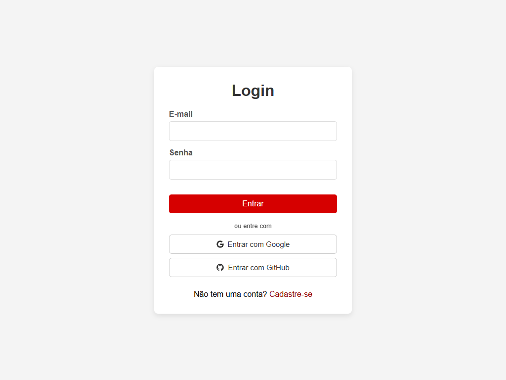
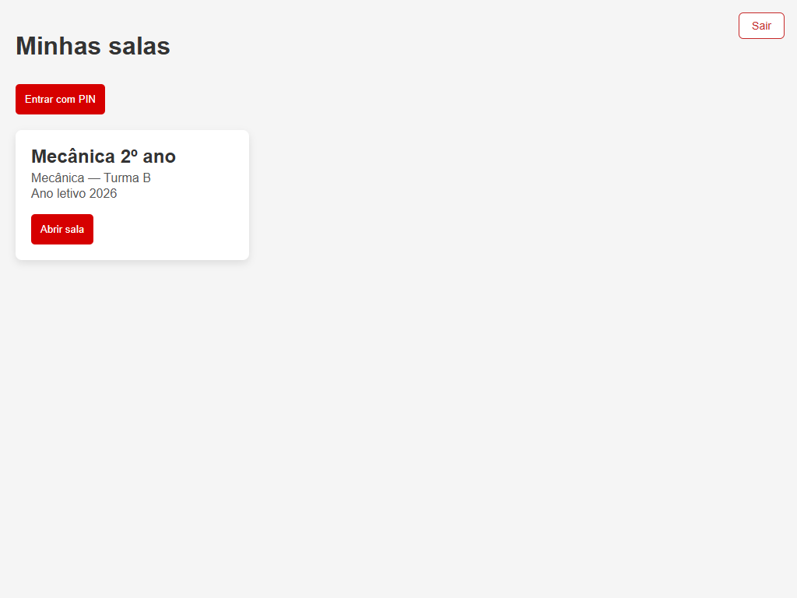
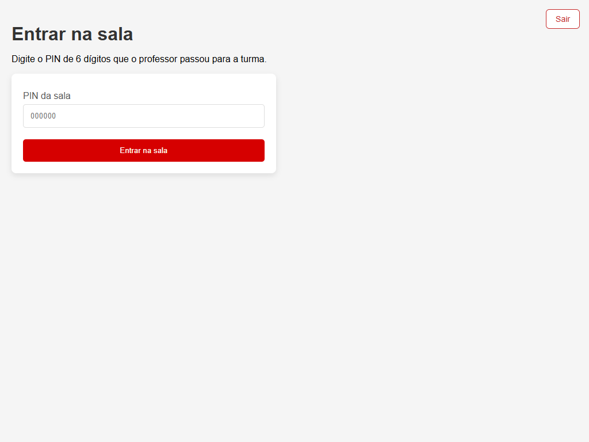
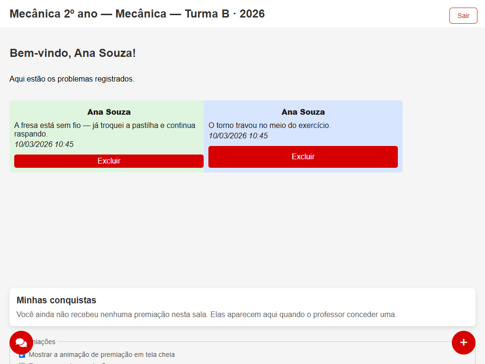
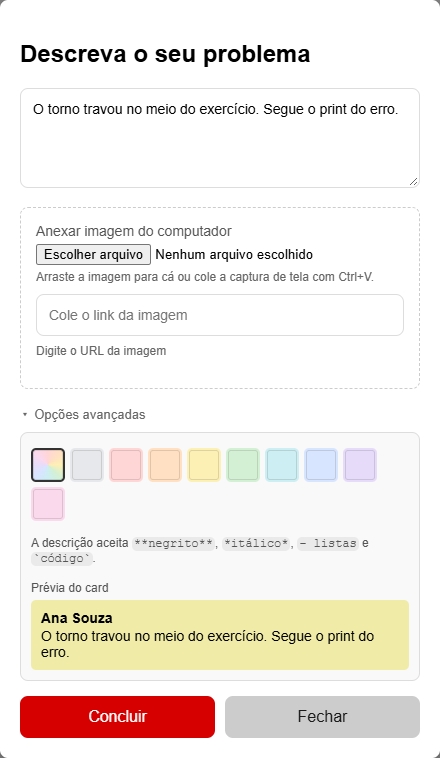
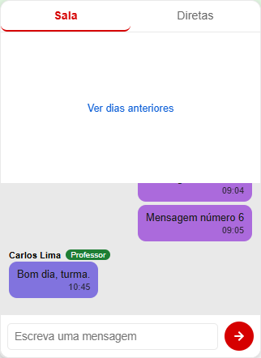

# Manual do aluno

> Versão 1.0.0. Este é o manual de quem **usa** o sistema durante a aula. Ele não
> pressupõe nada de informática além de saber usar um navegador.

Em vez de levantar a mão e esperar o professor chegar até você, aqui você **abre uma
dúvida**. Ela entra numa fila que o professor vê na tela dele na hora, com o seu nome e
com o print do erro, se você anexar um. Você continua trabalhando enquanto espera, e ele
atende na ordem de chegada.

As telas deste manual foram tiradas do sistema de verdade, na resolução das máquinas do
laboratório. Se a sua estiver um pouco diferente de tamanho, os botões são os mesmos.

---

## 1. Entrar no sistema

Você tem três caminhos, e pode usar qualquer um:

- **E-mail e senha** — se você criou uma conta pelo botão **Criar conta**.
- **Entrar com Google** — a conta que você já usa no celular.
- **Entrar com GitHub** — se você já tem uma.

Escolha um e fique com ele. Entrar com o Google e depois criar uma conta de e-mail com o
mesmo endereço faz o sistema enxergar duas pessoas diferentes, e as suas dúvidas antigas
ficam na outra.

**Você não precisa entrar de novo toda aula.** A sessão fica guardada no navegador daquela
máquina: no dia seguinte, abrindo o site, você já cai direto na sua sala. Ela só acaba
quando você clica em **Sair**.

> **Máquina compartilhada:** clique em **Sair** no fim da aula. O botão fica no canto
> superior direito de todas as telas. Sem isso, o próximo aluno que sentar naquela máquina
> abre o sistema como você — e pode abrir e excluir dúvidas no seu nome.

**Se der erro:** a mensagem embaixo do formulário diz o que aconteceu em português
("E-mail ou senha incorretos", "Este e-mail já está cadastrado"). Se aparecer uma tela
pedindo para você fechar uma janela que não abriu, o bloqueador de pop-up do navegador
barrou o login do Google — libere o site e tente de novo.

## 2. Entrar na sala com o PIN

Depois de entrar, você cai em **Minhas salas**. Na primeira vez, sem sala nenhuma, o campo
do PIN já aparece na tela, em **Entre na sua sala** — a conta nunca entra numa sala
sozinha. Quando você já tem sala e quer entrar em outra, use o botão **Entrar com PIN**.

Digite o **PIN de 6 dígitos** que o professor passou para a turma e clique em
**Entrar na sala**.

**Isso é uma vez por ano, não uma vez por aula.** A sala vale o ano letivo inteiro: você
digita o PIN em fevereiro e continua nela em novembro. Nas próximas aulas, a sala já está
esperando em **Minhas salas** — é só clicar em **Abrir sala**.

**Se o PIN não funcionar:**

- Confira os seis dígitos com o professor. A mensagem de erro é sempre a mesma
  ("PIN inválido"), de propósito: ela não diz se o número existe, para ninguém ficar
  chutando números até achar a sala de outra turma.
- O professor pode ter **gerado um PIN novo**. O antigo para de funcionar na hora em que
  isso acontece. Peça o número atual.
- Depois de **5 tentativas erradas em 5 minutos**, o sistema bloqueia novas tentativas por
  alguns minutos. Espere e peça o PIN certo — insistir só estende o bloqueio.

## 3. A fila da sala

Dentro da sala você vê **todas as dúvidas abertas da turma**, numa coluna só, da mais
antiga (em cima) para a mais nova (embaixo). Isso é
de propósito: metade das dúvidas de laboratório se repete, e ler o card de um colega
costuma resolver a sua antes de o professor chegar.

Cada card mostra quem abriu, logo abaixo a **data e o horário**, e depois o texto. Texto
comprido aparece cortado, com um botão cinza **Ler mais**. Se houver print, aparece o
**olho 👁️** no canto do card: clique nele para ver a imagem. O horário é o do
**servidor**, não o do relógio daquela máquina — em laboratório os relógios costumam estar
errados, e sem isso a fila sairia fora de ordem.

O botão vermelho **+**, no canto inferior direito, abre uma dúvida nova. O botão redondo no
canto inferior esquerdo abre o chat.

## 4. Abrir uma dúvida

Clique no **+**.

### 4.1 Descreva o problema

Escreva no campo de cima. O texto pode ter de **1 a 1000 caracteres** — a partir de 800
aparece um contador. Se passar de 1000, o botão avisa em vez de deixar você enviar e
descobrir depois que a dúvida não apareceu.

Descrição que ajuda o professor a chegar preparado:

- **o que você estava fazendo** ("no exercício 3, na hora de compilar");
- **o que aconteceu** ("dá erro de permissão negada");
- **o que você já tentou** ("já rodei como administrador").

### 4.2 Anexar um print

Três formas, todas no mesmo lugar:

- **Escolher arquivo** — abre a pasta do computador.
- **Arrastar** o arquivo para dentro da área tracejada.
- **Colar com `Ctrl+V`** — é a mais rápida: aperte `PrintScreen`, clique no formulário e
  cole. O print não precisa virar arquivo no disco.

Também dá para colar o **link de uma imagem** no campo de baixo, se ela já estiver na web.

Aceita **PNG, JPG, GIF e WebP**, até **5 MB**. Imagem maior que 1600 pixels de lado é
reduzida automaticamente antes de subir — a rede do laboratório agradece, e a leitura do
erro não piora.

Se você escolher um arquivo que não é imagem — um `.exe` renomeado para `.png`, por
exemplo — o sistema recusa. Ele confere o conteúdo do arquivo, não a extensão do nome.

> **Cuidado com o que aparece no print.** A tela inteira vai junto: a aba do lado, a
> notificação que chegou, o nome de arquivo no canto. O print é visível para a turma
> inteira. Recorte antes de colar, se tiver algo pessoal ali.

### 4.3 Escolher a cor e formatar o texto

Clique em **Opções avançadas** para abrir a paleta.

A **cor** é do seu card na fila. Serve para você achar a sua dúvida de longe e para
combinar com a turma ("as vermelhas são de máquina travada"). São dez cores, todas
testadas para o texto continuar legível em cima delas. A primeira é "automática": ela tira
uma cor do seu nome, e ela é sempre a mesma para você, em toda aula.

A descrição aceita um pouco de **formatação**:

| Você escreve | Sai assim |
|---|---|
| `**negrito**` | **negrito** |
| `*itálico*` | *itálico* |
| `` `código` `` | `código` |
| `- item` no começo da linha | lista |

A **prévia do card**, logo abaixo, mostra o resultado antes de enviar. Colar uma mensagem
de erro entre crases é o que mais ajuda: ela sai em fonte de máquina, sem o sistema tentar
interpretar os símbolos.

Clique em **Concluir**. O card aparece na sua fila e na tela do professor **na hora**,
sem ninguém precisar atualizar a página.

## 5. Excluir a sua própria dúvida

Quando você resolve sozinho, apague o card — é o que tira o seu nome da fila e deixa o
professor ir para quem ainda precisa.

No seu card, clique em **Excluir**. O sistema pergunta se é isso mesmo; confirme. Depois
disso aparece um aviso no rodapé com o botão **Desfazer**, que fica **5 segundos** na tela.
Clicou errado? Clique em Desfazer e a dúvida volta, com o print e tudo.

Passados os cinco segundos, a exclusão é definitiva: o card e o print saem do sistema e não
há como recuperá-los.

**Você só vê o botão Excluir nos seus próprios cards.** No card de um colega ele não
aparece — e não é só a tela que esconde: o servidor recusa a exclusão mesmo que alguém
tente por fora do sistema. O professor da sala pode excluir qualquer card, porque é ele
quem modera a fila.

## 6. Conversar no chat

O botão redondo no canto inferior esquerdo abre o chat. Ele tem duas abas:

- **Sala** — a conversa da turma inteira. Para o que se resolve com uma frase e não merece
  um card na fila.
- **Diretas** — conversas de duas pessoas. O professor abre uma com você quando precisa
  tratar de algo que não é da turma.

Cada mensagem tem até **500 caracteres** e mostra o horário do servidor. A cor do seu nome
é sempre a mesma, em toda mensagem e em toda aula, para você se achar na conversa de
relance. O professor tem um selo ao lado do nome.

Rolando para cima, as mensagens antigas vão carregando de 50 em 50. Só a conversa daquela
sala aparece ali: outra turma não lê o chat da sua.

**A conversa direta é entre duas pessoas e mais ninguém.** Nem outro aluno, nem outro
professor, nem o dono da sala consegue lê-la — isso é garantido pelo servidor, e não pela
tela.

**O que escrever aqui:** o chat é da aula. O professor pode apagar mensagem e pode limpar a
conversa inteira, e tudo o que você escreve fica visível para a turma toda.

## 7. As insígnias e as premiações

Às vezes o professor concede uma **premiação** a um aluno da sala. Ela aparece para você em
tela cheia da primeira vez, vira uma **insígnia** ao lado do seu nome nos cards e no chat, e
fica guardada na aba **Minhas conquistas**, ao lado da aba **Chamados** — inclusive depois
de vencer.

São quatro:

| Insígnia | O que reconhece |
|---|---|
| **Prioridade no Atendimento** | Você é atendido antes na fila, enquanto ela valer |
| **Destaque da Aula** | Reconhecimento do dia |
| **Colaborador** | Você ajudou um colega |
| **Resolvedor** | Você resolveu sozinho |

Só a **Prioridade no Atendimento** muda a ordem da fila. As outras três são reconhecimento,
e não furam fila — de propósito: assim o professor consegue elogiar quem ajudou um colega
sem, de quebra, atrasar o atendimento de outra pessoa.

Cada uma tem **nível de 1 a 3** e pode ter prazo (1, 7 ou 30 dias) ou ser permanente.
Quando vence, a insígnia sai do seu nome mas continua na vitrine — ninguém apaga o que você
fez.

**A animação incomoda?** Você pode pular a qualquer momento (botão **Pular** ou tecla `Esc`)
e pode desligá-la de vez em **Preferências**, na aba **Minhas conquistas**. O som nasce
**desligado** e só toca se você ligar. Se o seu sistema estiver configurado para reduzir
animações, ela já vira um card parado sozinha.

**Mexer no relógio da máquina não estica a premiação.** O prazo é conferido contra o
horário do servidor.

## 8. Perguntas que aparecem toda aula

**Apaguei sem querer e já passou o Desfazer. Dá para recuperar?**
Não. Abra a dúvida de novo — o texto você reescreve, e o print normalmente ainda está na
tela da sua máquina.

**Posso usar o sistema do celular?**
Pode. A tela se ajusta: a fila vira uma coluna e o chat ocupa a largura toda.

**Entrei na máquina errada e apareceu a conta de outro aluno.**
Clique em **Sair** e entre com a sua. Avise o colega para ele sair no fim da aula.

**Sumiu tudo da minha sala.**
Confira se o professor **arquivou** a sala — no fim do ano letivo ele faz isso, e a sala
passa a ser só leitura: você continua vendo tudo o que havia lá, mas não abre dúvida nova.
O aviso "Sala arquivada — somente leitura" aparece no topo.

**A página está em branco / o card não aparece.**
Recarregue com `Ctrl+F5`. Se continuar, é rede: o sistema volta a mostrar a fila sozinho
quando a conexão voltar, sem você perder nada do que já enviou.

---

Dúvida sobre o sistema em si — e não sobre a matéria — fale com o professor da sala. O lado
dele está em [`MANUAL-PROFESSOR.md`](MANUAL-PROFESSOR.md).
