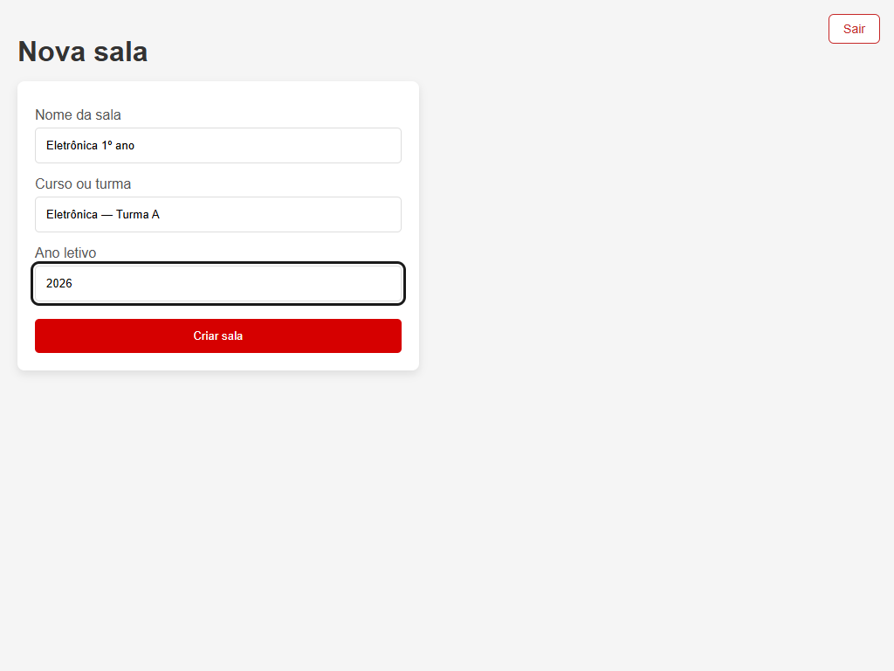
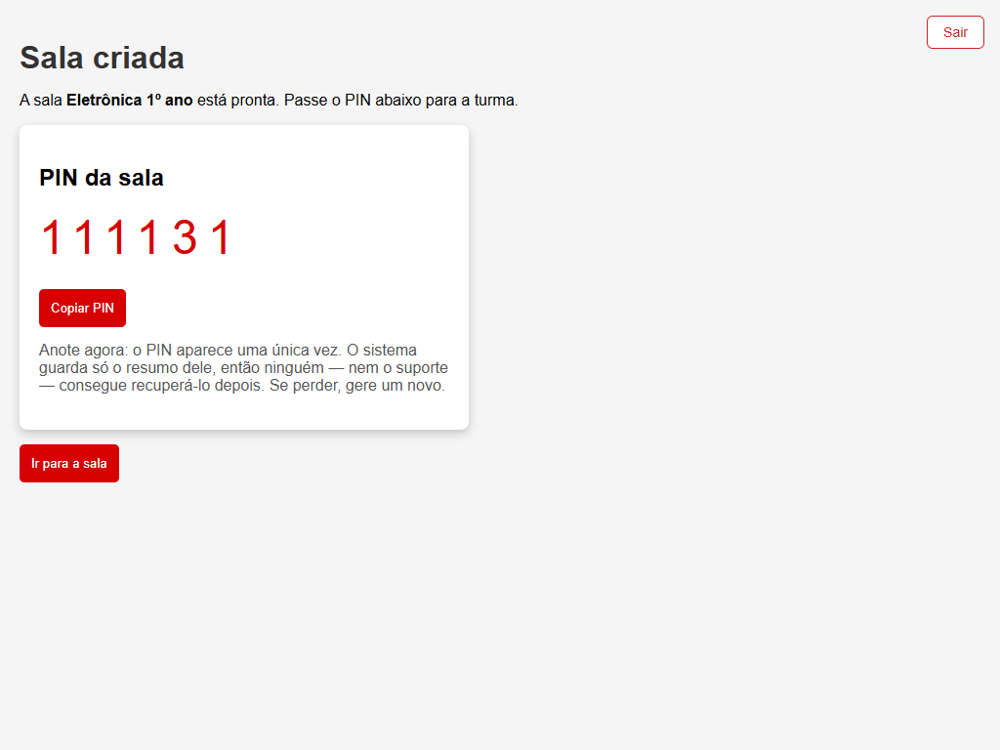
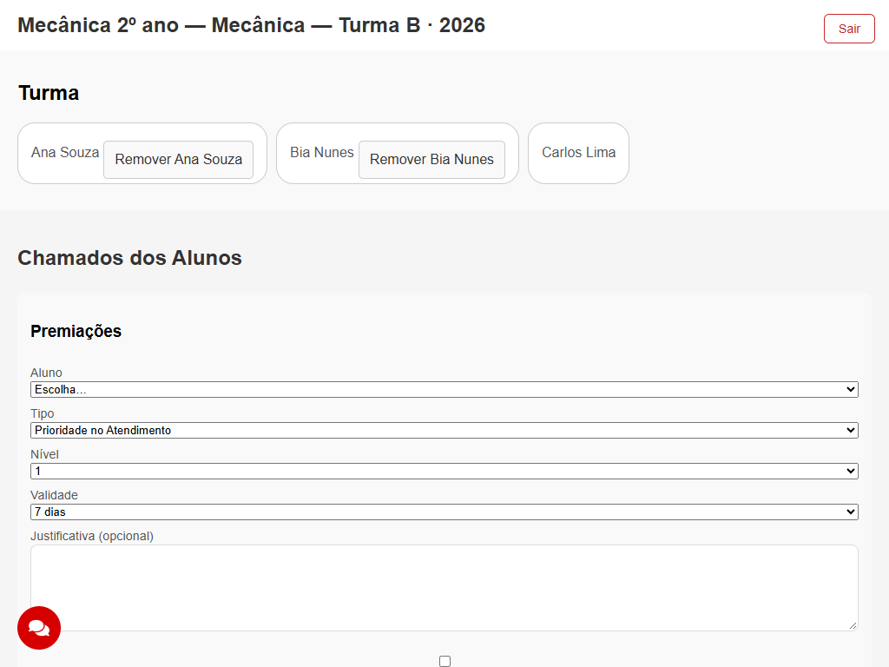
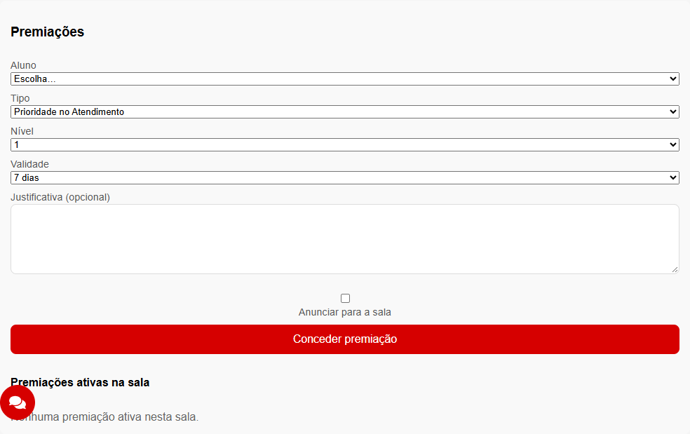

# Manual do professor

> Versão 1.0.0. O manual de quem **conduz** a aula com o sistema: criar a sala,
> distribuir o PIN, acompanhar a fila, moderar e fechar o ano. O lado do aluno está em
> [`MANUAL-ALUNO.md`](MANUAL-ALUNO.md).

O sistema troca o "levanta a mão e espera" por uma **fila de chamados** que você vê na sua
tela em tempo real, com nome, descrição e print do erro. Você atende na ordem, sem varrer o
laboratório com os olhos, e o aluno continua trabalhando enquanto espera.

As telas deste manual saíram do sistema de verdade, na resolução das máquinas do
laboratório.

---

## 1. Criar a sala

Você precisa ter acesso de professor. Há dois caminhos:

- **E-mail institucional `@sp.senai.br`** (o caminho normal). No **Cadastro**, escolha
  **Professor** e use o seu e-mail `@sp.senai.br`. O sistema manda um **link de
  confirmação** para essa caixa de entrada — confira também o spam. Abra o link e, em
  **Minhas salas**, clique em **Já confirmei**. Pronto: o botão **Criar sala** aparece.
  Até abrir o link, a conta funciona como aluno, e um aviso em **Minhas salas** lembra o
  que falta (com o botão **Reenviar e-mail**, se o link não chegou). Se você entrar com
  uma conta Google do domínio `@sp.senai.br`, o Google já entrega o e-mail confirmado e
  o acesso sai na hora.
- **Outro e-mail**: ele precisa estar na lista de autorizados, mantida pela coordenação no
  console do Firebase. Peça o cadastro do seu e-mail e entre de novo.

Em **Minhas salas**, clique em **Criar sala**.



| Campo | O que colocar |
|---|---|
| **Nome da sala** | Como a turma vai reconhecê-la: "Mecânica 2º ano" |
| **Curso ou turma** | O detalhe que separa duas salas parecidas: "Mecânica — Turma B" |
| **Ano letivo** | O ano corrente, já preenchido |

Uma sala por turma, e ela **vale o ano letivo inteiro**. Não crie uma sala por aula: o
aluno digita o PIN uma vez em fevereiro e continua entrando em novembro, e uma sala nova a
cada aula jogaria fora o histórico da turma.

## 2. Distribuir o PIN

Ao criar, o sistema mostra o PIN.



**Anote agora.** O PIN aparece **uma única vez**. O sistema não guarda o número — só um
resumo criptográfico dele —, então nem você, nem a coordenação, nem o suporte conseguem
recuperá-lo depois. Fechou a aba, perdeu o número.

Isso é deliberado, e é o que impede que um aluno da turma leia o PIN no banco e entre nas
salas de outras turmas. Se perder, não é problema: gere um novo (§ 3).

Como distribuir: escreva no quadro, projete, ou use o **Copiar PIN** e cole no grupo da
turma. O PIN é o que dá entrada na sala — trate-o como a chave da sala, não como um dado
público.

**Se o aluno errar o PIN** cinco vezes em cinco minutos, o sistema bloqueia as tentativas
dele por alguns minutos. É a proteção contra alguém ficar chutando números até achar a sala
de outra turma; o aluno só precisa esperar e usar o número certo.

## 3. Gerar um novo PIN

Em **Minhas salas**, no cartão da sua sala, há o botão **Gerar novo PIN**.

O PIN anterior **para de funcionar na hora**. Quem já é membro da sala **continua dentro** —
o PIN é a porta de entrada, não a permissão de ficar. Ninguém é expulso.

Gere um novo quando:

- o número vazou para fora da turma;
- você perdeu o papel onde anotou;
- alguém entrou que não devia — aí **remova o aluno** pelo painel **Turma** (§ 4), que já
  gera um PIN novo junto, e o removido não consegue voltar com o número antigo.

## 4. A fila da sala



> Desde a versão 1.1.0 a sala abre em abas: **Chamados** (a fila, que abre sempre
> primeiro), **Premiações** e **Turma**. As duas últimas só aparecem para o dono da sala.
> A captura acima ainda mostra o layout antigo, com tudo empilhado.

Abrindo a sala você tem três abas:

**A aba Turma** — quem está na sala. Cada nome tem **Remover**, que tira o aluno do
vínculo e regera o PIN na mesma ação. O seu próprio nome não tem botão: sem dono, ninguém
poderia arquivar a sala nem gerar um PIN novo.

**Os chamados dos alunos** — a fila, em tempo real, na ordem de chegada. O horário de cada
card é o do **servidor**, e não o da máquina do aluno: em laboratório os relógios costumam
estar errados, e sem isso a ordem da fila não valeria nada.

Quem tem **Prioridade no Atendimento** (§ 6) sobe na fila. Dentro da mesma faixa, continua
valendo quem chegou primeiro.

A cor de cada card é escolha do aluno. Vale combinar um código com a turma no começo do ano
("vermelho é máquina parada") — a fila passa a ser legível de longe.

A fila carrega de 30 em 30. Numa sala cheia — o alvo do sistema são 40 alunos e 200
chamados por sala — você rola e o resto vem.

### Marcar como atendido

Cada card tem **Atendido**. Ele é um interruptor: clicou, marca; clicou de novo,
desmarca. Não pede confirmação de propósito — uma caixa de diálogo a cada chamado atendido
atrapalharia justamente a hora em que você está circulando pela sala.

Marcar guarda **quando** foi atendido, pelo horário do servidor. É o que permite, depois,
saber quanto tempo a turma esperou.

### Excluir um chamado

Ao lado, **Excluir** — você pode excluir qualquer card da sua sala, o aluno só o dele.
O sistema pede confirmação e oferece **5 segundos de Desfazer** no rodapé. Passados eles, o
card e o print saem para sempre.

Use para limpar duplicata e para tirar da fila o que foi aberto por engano. O aluno também
exclui o próprio quando resolve sozinho — combine isso com a turma, é o que mantém a fila
honesta.

## 5. Moderar o chat e usar a mensagem direta

O botão redondo no canto inferior esquerdo abre o chat, com duas abas.

### A aba Sala

A conversa da turma. Mensagens de até 500 caracteres, com o horário do servidor e um selo
ao lado do seu nome, para a turma distinguir a sua fala da de um colega.

Você pode **apagar qualquer mensagem** da sala. E, para limpar a conversa inteira, envie o
comando:

```
!clear
```

Ele apaga todas as mensagens daquela sala e **só funciona para o dono da sala** — o aluno
que digitar recebe uma recusa, e a recusa vem do servidor, não da tela. Não há como
desfazer um `!clear`: o histórico da conversa vai embora. Use no começo do ano ou quando a
conversa descarrilhar de vez.

Apagar mensagem **não** apaga chamado: são coisas separadas, e a fila continua intacta.

### A aba Diretas

Conversa de duas pessoas. Abra uma com um aluno quando o assunto não for da turma — um
aviso sobre entrega, uma orientação que não cabe no quadro.

**Só os dois participantes leem a conversa direta.** Nem outro aluno, nem outro professor,
nem o dono da sala — isso é imposto pelo servidor, e vale para você também: a conversa
direta entre dois alunos da sua sala não é acessível a você. É o que faz o canal servir
para o que ele existe.

A lista mostra as conversas com mensagem não lida em destaque.

## 6. As premiações

Uma premiação é um reconhecimento que **você** dá a um aluno da **sua** sala. Ela aparece
para ele numa tela cheia, vira uma insígnia ao lado do nome no card do chamado e no chat, e
fica guardada na vitrine "Minhas conquistas" dele — inclusive depois de vencer.

Existem quatro tipos:

| Tipo | Para quê | Mexe na fila? |
|---|---|---|
| **Prioridade no Atendimento** | Quem você quer atender antes | **Sim** |
| **Destaque da Aula** | Reconhecimento do dia | Não |
| **Colaborador** | Quem ajudou um colega | Não |
| **Resolvedor** | Quem resolveu sozinho | Não |

Só **Prioridade no Atendimento** muda a ordem da fila. Os outros três são reconhecimento
puro, e isso é de propósito: se toda premiação furasse a fila, você não teria como elogiar
quem ajudou um colega sem, de quebra, atrasar o atendimento de outra pessoa.

Cada premiação tem um **nível de 1 a 3**. No caso da prioridade, o nível é a faixa: nível 2
é atendido antes de nível 1, que é atendido antes de quem não tem perk. Dentro da mesma
faixa, continua valendo quem chegou primeiro.

### Como conceder



1. Abra a sua sala. O painel **Premiações** aparece logo acima da fila — só para o dono da
   sala.
2. Escolha o aluno, o tipo e o nível.
3. Escolha a **validade**: 1, 7 ou 30 dias, ou "sem validade (permanente)".
4. Escreva a **justificativa** (opcional, até 280 caracteres).
5. Clique em **Conceder premiação**.

A confirmação aparece na hora. O aluno vê a premiação em tela cheia na próxima vez que abrir
a sala — **uma vez só**; ela não repete a cada recarga.

### Quando conceder — e quando não

A premiação vale pelo que ela reconhece, não pela mecânica. Ela funciona quando o aluno
consegue dizer **o que fez** para ganhá-la, e é por isso que a justificativa importa mais do
que o tipo.

**Bons momentos:** o aluno que parou o próprio trabalho para desatolar o colega; quem
entregou no prazo depois de uma sequência de atrasos; quem chegou sozinho na causa de um
erro em vez de pedir a resposta pronta.

**Cuidados:**

- **Prioridade tem custo.** Toda prioridade que você concede empurra alguém para baixo na
  fila. Use prazo curto (1 ou 7 dias) e reserve-a para quando ela significar alguma coisa.
- **Premiar sempre os mesmos esvazia o gesto.** A vitrine do aluno é pública para ele, mas a
  turma percebe o padrão de qualquer jeito.
- **Nível 3 permanente é quase sempre demais.** Ele não vence nunca, e você vai precisar
  revogar à mão para desfazer.

### A justificativa é visível para a turma inteira

Leia esta seção antes de escrever a primeira justificativa.

A caixa **"Anunciar para a sala"** controla o que a interface **exibe** para os colegas. Ela
**não** esconde o texto do banco de dados: as regras de segurança do Firestore liberam ou
bloqueiam o documento inteiro, nunca campo por campo, e qualquer aluno da sala com
conhecimento técnico consegue ler a justificativa de qualquer premiação da turma.

Na prática: **escreva a justificativa como se a turma fosse ler**, porque ela pode. Não
escreva nela nada sobre a vida particular do aluno, nota, diagnóstico, situação familiar ou
qualquer coisa que você não diria em voz alta na sala.

Se precisar registrar algo reservado, não use a justificativa — use o canal que a escola já
usa para isso.

### Como revogar

No mesmo painel, cada premiação ativa tem um botão **Revogar**.

Revogar **não apaga** a premiação. Ela some da fila e da insígnia na hora, e passa para o
histórico da vitrine do aluno, marcada como revogada. Isso é deliberado: apagar reescreveria
o passado da turma.

Toda concessão e toda revogação ficam registradas com quem fez, para quem, quando e por quê.
O registro não pode ser alterado nem apagado por ninguém — nem por você.

## 7. Arquivar a sala no fim do ano

Em **Minhas salas**, no cartão da sua sala, clique em **Arquivar sala**.

A sala arquivada vira **somente leitura**:

- ninguém entra mais com o PIN, e o PIN em destaque some;
- não se abre chamado, não se envia mensagem, não se concede nem se revoga premiação;
- **tudo o que havia continua visível** — fila, chat, conversas e vitrines — para você e
  para os alunos que eram membros.

Arquivar não apaga nada, e é exatamente o ponto: o registro do ano fica de pé, e a turma
nova entra numa sala nova, sem herdar a fila da turma anterior.

Arquive no fim do ano letivo. Durante o ano, se a turma parar de usar, basta deixar como
está: sala sem movimento não custa nada.

## 8. Perguntas frequentes

**O aluno pode dar perk a si mesmo?**
Não. Isso é bloqueado no servidor, não na tela: mesmo adulterando o navegador, a escrita é
recusada.

**E um professor de outra sala?**
Também não. Quem concede é o dono **daquela** sala.

**Um aluno pode virar professor mexendo no navegador?**
Não. O papel vem do e-mail `@sp.senai.br` **confirmado** ou da lista de autorizados, e o
servidor confere as duas coisas a cada escrita. Mudar o que está guardado no navegador não
promove ninguém, e digitar um e-mail `@sp.senai.br` que não é seu não adianta: sem abrir o
link que chega naquela caixa de entrada, a conta continua aluno.

**O aluno pode esticar o perk mexendo no relógio do computador?**
Não. A validade é conferida contra o horário do servidor, e não contra o relógio da
máquina. Atrasar o relógio não revive um perk vencido; adiantá-lo só encurta o perk de quem
adiantou.

**Um aluno consegue ver a fila de outra turma?**
Não. Cada sala é um compartimento fechado no banco, e quem não é membro recebe recusa do
servidor — não é a tela que esconde.

**A animação atrapalha a aula. Dá para desligar?**
Dá, de três formas: o aluno tem o botão **Pular** (sempre visível) e a tecla `Esc`; ele pode
desmarcar "Mostrar a animação de premiação em tela cheia" nas preferências da sala; e, se o
sistema operacional dele estiver com `prefers-reduced-motion` ligado, a premiação já vira um
card parado automaticamente.

**E o som?**
O som nasce **desligado** e só toca se o aluno ligar nas preferências. Nenhuma premiação toca
áudio sozinha no primeiro carregamento.

**Perdi o PIN e a sala já tem trinta alunos. Preciso recriar a sala?**
Não. Gere um novo PIN (§ 3): quem já está dentro continua dentro.

## Para quem quiser o detalhe técnico

O modelo de dados, as decisões de segurança e o fluxo do PIN estão em
[`ARQUITETURA.md`](ARQUITETURA.md) e [`SEGURANCA.md`](SEGURANCA.md). As decisões de
modelagem, ordenação da fila e validade das premiações estão em
[`docs/adr/0010-modelo-de-perks-e-ordenacao-da-fila.md`](adr/0010-modelo-de-perks-e-ordenacao-da-fila.md).
